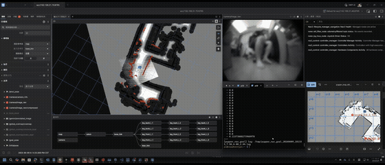
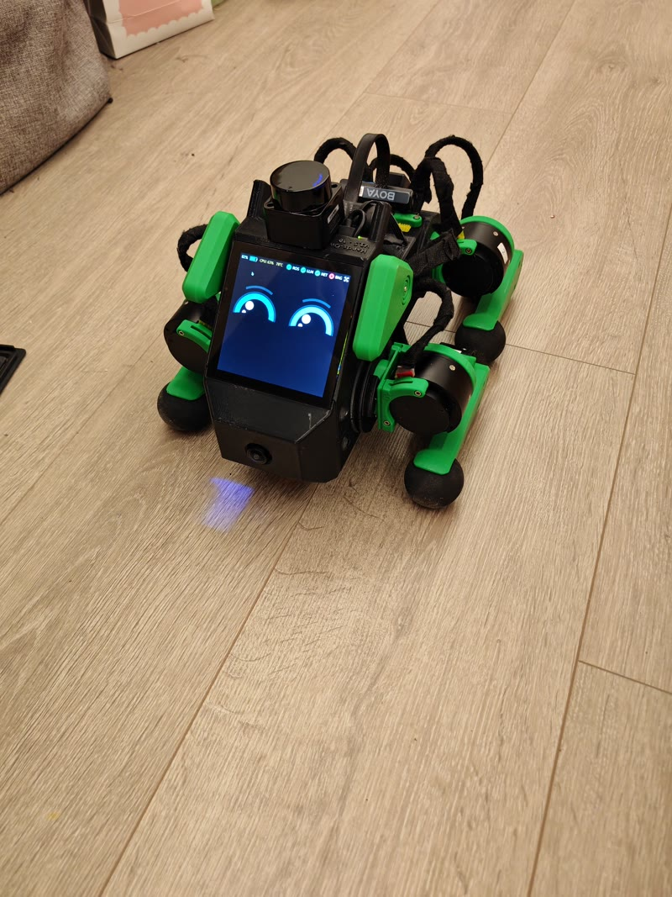

# Pupper V3 Codebase

Fork of the [Pupper v3 monorepo](https://github.com/Nate711/pupperv3-monorepo) with **full Raspberry Pi 5 on-robot stack**: locomotion, SLAM, Nav2 navigation, voice agent (Pupster/Jarvis), Rust UI, and deployment tooling developed on top of the upstream project.

---

## Demo — Nav2 AMCL on real robot / 實機 Nav2 導航



<p align="center">
  
</p>

[Click here — original demo video](docs/pupperv3_amcl_nav2.mp4)

---

## Full RPi system architecture

Everything below runs on the **Raspberry Pi 5** (`robot.service` + companion systemd units). There is no separate PC required for SLAM or Nav2 in the current deployment.

```
┌─────────────────────────────────────────────────────────────────────────────┐
│                         Raspberry Pi 5 (ROS 2 Jazzy)                        │
├─────────────────────────────────────────────────────────────────────────────┤
│  SYSTEMD SERVICES                                                           │
│  ┌──────────────┐  ┌──────────────┐  ┌──────────────┐  ┌──────────────┐   │
│  │ robot.svc    │  │pupster-wake  │  │ llm-agent    │  │ pupper-bridge│   │
│  │ neural_ctrl  │  │ OpenWakeWord │  │ LiveKit agent│  │ HTTP :8095   │   │
│  │ LiDAR/camera │  │ "Hey Jarvis" │  │ STT→LLM→TTS  │  │ OpenClaw API │   │
│  │ EKF/odom     │  └──────┬───────┘  └──────┬───────┘  └──────┬───────┘   │
│  │ animation    │         │ gate           │ ROS tools        │ REST→ROS  │
│  └──────┬───────┘         ▼                ▼                  ▼           │
│         │          /tmp/pupster_gate   /llm_cmd_vel      move/TTS/VLM     │
│         │                                              pupper-rs (GUI)   │
├─────────┴───────────────────────────────────────────────────────────────────┤
│  ROS 2 GRAPH (always-on via robot.sh)                                       │
│                                                                             │
│  Perception          Odometry / TF              Mapping / Nav               │
│  ┌────────────┐      ┌─────────────────┐       ┌─────────────────┐          │
│  │ LD06 LiDAR │      │ dead_reckoning  │       │ pupper_slam     │ (manual) │
│  │  → /scan   │      │  → /odom/raw    │       │ slam_toolbox    │          │
│  │ camera_ros │      │ imu_madgwick    │       │  → /map         │          │
│  │ hailo YOLO │      │  → /imu/data_   │       ├─────────────────┤          │
│  └────────────┘      │     filtered    │       │ pupper_nav      │ (manual) │
│                      │ EKF → /odom     │       │ Nav2 AMCL       │          │
│                      │  odom→base_link │       │ planner+DWB     │          │
│                      └─────────────────┘       │  → /nav_cmd_vel │          │
│                                                └─────────────────┘          │
│  Control                                                                    │
│  ┌──────────────────────────────────────────────────────────────┐           │
│  │ cmd_vel_mux: teleop > nav > llm > person_following           │           │
│  │      → /cmd_vel → neural_controller (RTNeural policy)        │           │
│  │ animation_controller_py (CSV tricks at waypoints)            │           │
│  └──────────────────────────────────────────────────────────────┘           │
└─────────────────────────────────────────────────────────────────────────────┘
```

Nav2 publishes to `/nav_cmd_vel`; `pupper_nav/launch/nav.launch.py` remaps `cmd_vel` accordingly.  
`cmd_vel_mux` priority is configured in `neural_controller/launch/config.yaml` (teleop highest).

### Audio / voice pipeline (Pupster / Jarvis)

**English:** Three services — `pupster-wake` (OpenWakeWord) → `/tmp/pupster_gate` → `llm-agent` (LiveKit, pre-warmed with gated mic) → ROS tools. TTS uses **DashScope Qwen Realtime** (replaced Cartesia after quota exhaustion). STT/LLM default: **OpenAI Realtime** (`gpt-realtime`).

**中文：** 三服務架構 — 喚醒詞常駐 → gate 檔 IPC → llm-agent 預熱（閒置不送 audio 以省 API）。TTS 已改 **DashScope Qwen Realtime**；LLM 預設 **OpenAI Realtime**。語音可驅動 `/llm_cmd_vel`、特技動畫、相機工具。

```
USB mic → pupster_wake ("Hey Jarvis") → /tmp/pupster_gate
       → llm-agent: OpenAI Realtime (STT+LLM) + dashscope_tts (TTS)
       → ros_tool_server → /llm_cmd_vel, animations, camera
       → USB speaker (PipeWire)
```

| Topic | 說明 |
|-------|------|
| Wake deploy | `scripts_local/pupster_wake/` *(local only)* |
| Full agent docs | **`ai/llm-ui/agent-starter-python/README.md`** |
| TTS plugin | `ai/llm-ui/agent-starter-python/src/dashscope_tts.py` |
| Vision | Fast: `get_camera_image` (~1–2s); Nav: `analyze_camera_image` + Gemini (~4s) |
| Operator runbook | `PUPSTER_NOTES.md` *(local workspace reference)* |

### HTTP bridge (OpenClaw / remote control) — `pi_home/`

**English:** `pupper-bridge.service` runs `/home/pi/pupper_bridge.py` — FastAPI on port **8095** for **OpenClaw**, Jetson Thor, or any HTTP client. Endpoints: move/stand/animation, TTS (DashScope or CosyVoice on Thor), camera capture/describe (VLM). Separate from on-robot Pupster voice (`llm-agent`).

**中文：** Pi 上的 HTTP 橋接器供 **OpenClaw 等外部 agent** 呼叫，不走 LiveKit。TTS 可走 DashScope 或 Thor 上的 CosyVoice；`/camera/describe` 回文字描述（避免大圖塞爆 OpenClaw context）。

| Path | Role |
|------|------|
| **`pi_home/`** | `pupper_bridge.py`, TTS workers, systemd example — [README](pi_home/README.md) |
| Deploy on Pi | Copy to `/home/pi/`; `systemctl enable pupper-bridge.service` |

### In-monorepo adapters (ROS / web UI)

| Package | Role |
|---------|------|
| `llm_websocket_server` | WebSocket (`localhost:8765`) for live-audio web UI |
| `openai_bridge` | Legacy OpenAI Realtime + eye animation helpers |
| `ros_tool_server` | LiveKit **Pupster** tool calls → ROS (inside `llm-agent`) |

### Rust UI (`pupper-rs`)

Desktop/robot status UI (eyes, service health, ROS topic checks). Deploy from your local `scripts_local/deploy_pupper_gui.py` if present.

---

## Pi overlay workspaces (`pi_overlay/`)

On the Pi, two **extra colcon workspaces** live under `/home/pi/` (not inside this monorepo tree). We track **vcstool manifests + docs**, not `build/`/`install/` (~780MB for Nav2).

| Pi path | Repo | Purpose |
|---------|------|---------|
| `/home/pi/nav2_ws` | [pi_overlay/nav2_ws](pi_overlay/nav2_ws/) | Nav2 + BehaviorTree.CPP source build (Jazzy) |
| `/home/pi/ldlidar_ros2_ws` | [pi_overlay/ldlidar_ros2_ws](pi_overlay/ldlidar_ros2_ws/) | LD06 driver → `/scan` |

Source order used by `pi_start_nav.sh`:

```bash
source /opt/ros/jazzy/setup.bash
source ~/ldlidar_ros2_ws/install/setup.bash
source ~/nav2_ws/install/setup.bash
source ~/pupperv3-monorepo/ros2_ws/install/setup.bash
```

Build: `scripts_local/build_nav2_source_pi.py`; LiDAR: `vcs import` + `colcon build` per overlay README.

---

## SLAM

Built on **slam_toolbox** async online mapping, aligned with Mini Pupper patterns:

| Item | Location |
|------|----------|
| SLAM launch + config | `ros2_ws/src/pupper_slam/` |
| Mapper params | `config/mapper_params_online_async.yaml` |
| Pi build helper | `scripts_local/build_slam_jazzy_pi.py` |
| Start mapping | `pi_reset_slam.sh` + slam launch (see `pupper_slam`) |
| Reset session | `scripts_local/pi_reset_slam.sh` |
| Save Nav2-compatible map | `scripts_local/pi_save_map.sh` |

**Odometry for SLAM:** EKF fuses `/odom/raw` + Madgwick-filtered IMU (`/imu/data_filtered`) → `/odom` and `odom→base_link` TF. Config in `ros2_ws/src/pupper_odometry/`.

CPU notes: run SLAM **without** Foxglove connected during long mapping sessions; `foxglove_bridge` is the largest optional CPU consumer.

---

## Navigation

See **[Demo](#demo--nav2-amcl-on-real-robot--實機-nav2-導航)** above for screenshot and MP4.

Nav2 runs **on the Pi** (source-built for Jazzy on Pi OS — no Noble apt packages):

| Item | Location |
|------|----------|
| Nav2 params (AMCL, SmacPlanner, DWB) | `ros2_ws/src/pupper_nav/config/nav2_params.yaml` |
| Bringup launch | `ros2_ws/src/pupper_nav/launch/nav.launch.py` |
| Build Nav2 on Pi | `scripts_local/build_nav2_source_pi.py` |
| Deploy + build workspace | `scripts_local/deploy_nav.py` |
| Start navigation | `scripts_local/pi_start_nav.sh` |

Quick start on robot:

```sh
~/pupperv3-monorepo/scripts_local/pi_start_nav.sh pupper_map_ekf_v1
```

Verified AMCL initial pose (also in `nav2_params.yaml`):

```text
x = 7.20   y = 4.40   yaw = 2.60
```

Helper scripts (committed in this repo):

```sh
~/pupperv3-monorepo/scripts_local/pi_reset_slam.sh
~/pupperv3-monorepo/scripts_local/pi_save_map.sh
~/pupperv3-monorepo/scripts_local/pi_start_nav.sh pupper_map_ekf_v1
~/pupperv3-monorepo/scripts_local/pi_nav_status.sh
~/pupperv3-monorepo/scripts_local/pi_nav_initialpose.sh 7.20 4.40 2.60
~/pupperv3-monorepo/scripts_local/pi_nav_goal.sh 7.50 4.00 2.44
```

Additional SLAM/odom/wake-word/TTS deploy scripts may exist on your dev machine under `scripts_local/` but are **not tracked in this repo** (kept local on purpose).

Full procedure: **`NAV2_RUNBOOK.md`**.

---

## Deploying to real robot

Follow [official Pupper v3 software installation](https://pupper-v3-documentation.readthedocs.io/en/latest/guide/software_installation.html) to flash the Raspberry Pi 5 image, then sync this repo to `/home/pi/pupperv3-monorepo`.

Typical services on Pi:

```text
robot.service          # robot.sh → neural_controller launch (odom_ekf:=True)
pupster-wake.service   # wake word → /tmp/pupster_gate
llm-agent.service      # LiveKit Pupster agent (on-robot voice)
pupper-bridge.service  # HTTP API :8095 for OpenClaw / remote control
pupper-rs.service      # Rust UI (optional)
```

Before walking or navigating: **Start (9) → X (0)** on gamepad to activate `neural_controller`.

---

## Deploying to simulated robot (x86 Ubuntu 24)

```sh
sudo apt install git-lfs
git lfs install
git clone https://github.com/tommywu052/pupperv3-monorepo.git --recurse-submodules
./install_dev_dependencies.sh
cd ros2_ws && source build.sh
```

---

## `scripts_local/` (repo subset)

The repo tracks **navigation/SLAM deployment helpers only** (9 files):

| File | Purpose |
|------|---------|
| `build_nav2_source_pi.py` | Build Nav2 from source on Pi |
| `build_slam_jazzy_pi.py` | Build slam_toolbox on Pi |
| `deploy_nav.py` | Deploy `pupper_nav` + workspace to Pi |
| `pi_reset_slam.sh` | Reset SLAM session |
| `pi_save_map.sh` | Save Nav2-compatible map |
| `pi_start_nav.sh` | Start Nav2 stack |
| `pi_nav_*.sh` | Status, initial pose, goal helpers |

Wake-word (`pupster_wake/`), odom/EKF deploy, TTS tuning, SSH helpers, and other diagnostics live in a **local-only** `scripts_local/` tree on the dev machine and are intentionally not committed.

---

## Docs

- Upstream hardware/software: [Pupper v3 documentation](https://pupper-v3-documentation.readthedocs.io/en/latest/)
- Nav2 on Pi: `NAV2_RUNBOOK.md`
- OpenClaw / HTTP bridge: `pi_home/README.md`
- Pi overlay workspaces: `pi_overlay/README.md`
- Pupster voice agent: `ai/llm-ui/agent-starter-python/README.md`
- SLAM / LiDAR integration log: `cursor_lidar_integration_and_verificati.md`

---

## Notes

* Camera FPS defaults to 10 Hz (`FrameDurationLimits: [100000, 100000]` in `ros2_ws/src/neural_controller/launch/config.yaml`).
* TTS uses **DashScope Qwen Realtime** (Singapore intl endpoint); Cartesia was removed after quota exhaustion.
* `animation_controller_py` stays enabled for waypoint tricks; it switches from neural to forward controllers on `/animation_controller_py/animation_select`.

---

## Development

### Adding animations

1. Hold L1 until BAG status icon turns green (mcap recording).
2. Move Pupper through desired motion; press R1 to stop.
3. Verify in Foxglove; move bag to `bags/`.
4. On robot: `scripts/mcap_to_csv.py [mcap] -s START -e END` → copy CSV to `ros2_ws/src/animation_controller_py/launch/animations`.
5. Rebuild: `./build.sh`; update `pupster.py` with animation nickname.

### Camera / vision (sim)

```sh
ros2 launch hailo detection_with_mock_camera_launch.py
ros2 run foxglove_bridge foxglove_bridge
```
